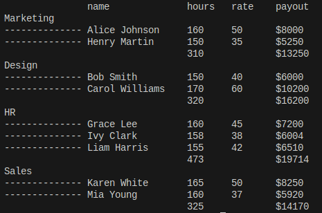
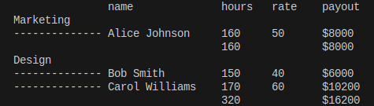
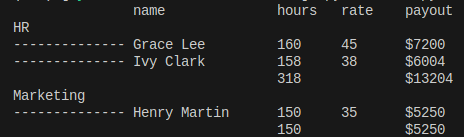

Тестовое задание для Workmate
# Скрипт подсчёта зарплаты сотрудников

## Задание
Нужно написать скрипт, который читает данные сотрудников из файлов в формате csv и формирует простой отчет по заработной плате (см. ниже примеры). В скрипт можно передать несколько файлов и тип отчета который нужно сформировать, в данном случае отчёт по зарплатам payout. Файлы на вход всегда в формате csv, валидные и без ошибок. Название отчета передается через  параметр --report. Реализовать нужно только отчёт по зарплатам, но желательно заложить возможность добавления новых отчётов, например если захочется посмотреть среднюю ставку в час по отделам то это можно будет быстро добавить.


## Пример отчёта


## Установка и запуск

1. **Клонировать репозиторий:**
   ```bash
   git clone https://github.com/ryazd/SalaryCalculation.git
   ```

2. **Создать виртуальное окружение:**
   ```bash
   python -m venv venv
   source venv/bin/activate
   ```

3. **Установить зависимости для тестирования (pytest):**
   ```bash
   pip install -r requirements.txt
   ```

4. **Запустить скрипт с входными файлами:**
   ```bash
   python main.py data/data1.csv data/data2.csv data/data3.csv --report payout
   ```

## Тестирование
1. **Запустить тесты**
    ```bash
    pytest
    ```
2. **Проверить покрытие**
    ```bash
    pytest --cov
    ```

## Примеры работы
**Команда**
    ```bash
    python main.py data/data1.csv --report payout
    ```

**Рузультат**




**Команда**
    ```bash
    python main.py data/data2.csv --report payout
    ```

**Рузультат**


